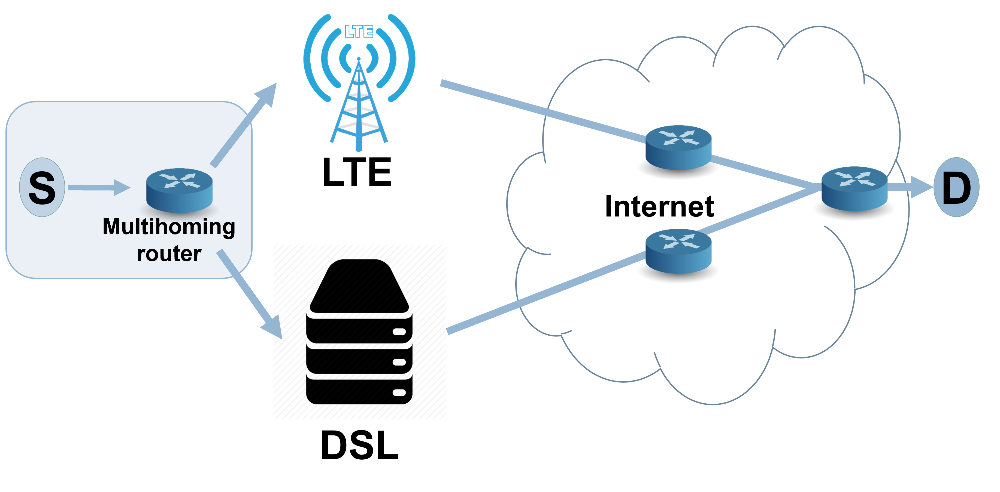

# 2SYN Project
The 2SYN, a lightweight algorithm that can dynamically select a preferred path for TCP connections.
The 2SYN algorithm leverages the TCP 3-way handshake protocol to determine the path with the best RTT (round-trip time). 
To do so, when opening a TCP
flow to the destination, it sends an SYN on each of the available router links.
It then uses the router link to obtain the first SYN-ACK to route future packets while disregarding the other paths. 




In addition, this project supports finding the best path by using lightweight machine learning (ML) algorithms from a multi-armed bandit (MAB) Family.
The project supports three types of algorithms:
1. ε - greedy algorithm. One of the simplest and most well-
studied in the MAB algorithms family. A deterministic algorithm chooses the historically-preferred route with a probability of 1 − ε and explores other routes uniformly at random with a probability of ε.
1. Upper Count Bound (UCB1) algorithm. UCB is a deterministic algorithm that chooses the preferred route according to the average past results and the confidence boundary on the machine. 
2. Thompson sampling algorithm. This is a stochastic bayesian algorithm that tries to model the throughput distribution of each route. The Thompson sampling uses a parametrized beta distribution for each route. For each new flow, we sample the Beta distribution of each path and choose the path with the maximum value.

# Installation
* Install python (version 3)
* Install python [Scapy api](https://scapy.readthedocs.io/en/latest/installation.html)
* Configure the networking interfaces parameters in the configuration file ```networking.cfg```

# Run
To run the 2SYN algorithm please use the command:  
>``` make run-2syn```

To run Epsilon greedy algorithm please use the command:  
>``` make run-epsilon```

To run UCB algorithm please use the command:  
>``` make run-ucb```

To run Epsilon greedy algorithm please use the command:  
>``` make run-th-sampling```